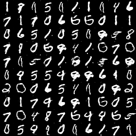
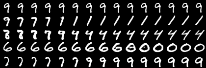
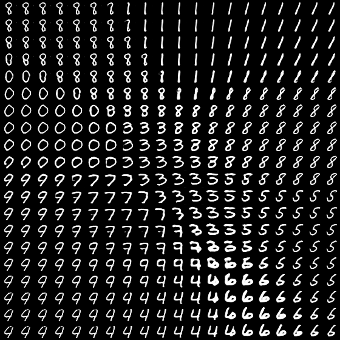
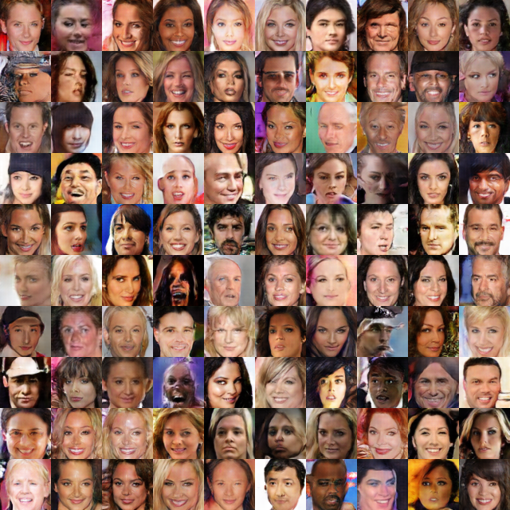
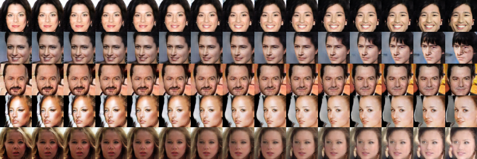
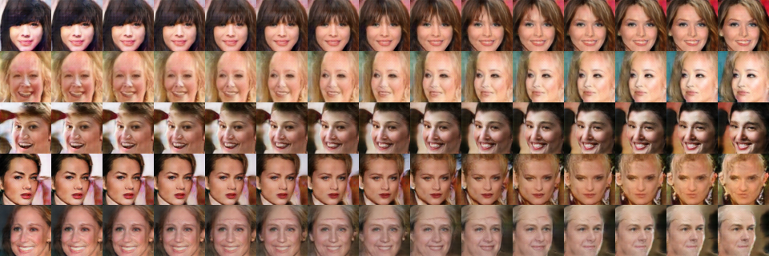

# Deep Convolutional Generative Adversarial Networks (DCGAN)

- TensorFlow implementation of [Unsupervised Representation Learning with Deep Convolutional Generative Adversarial Networks](https://arxiv.org/abs/1511.06434) (ICLR 2016). 
- Both generator and discriminator are multiple layers CNNs. Generator takes a random vector as input. Discriminator takes real and fake images as input. Feature maps are up-sampled and down-sampled through convolutional layers with stride = 2, so there is no pooling layer.
 
## Implementation Details
- DCGAN model is defined in [`/src/nets/dcgan.py`](/src/nets/dcgan.py). An example to show how to train and test the model is defined in [`examples/gans.py`](../../examples/gans.py).
- Random input vector are uniformly sampled within [-1, 1].
- As mentioned in the paper, [batch normalization](https://arxiv.org/abs/1502.03167) is used for all layers of generator and discriminator except the first and output layer of discriminator and the last layer of generator.
- ReLU is used in the generator except for the output, which uses Tanh. LeakyReLU with Leaky = 0.2 is used in the discriminators.
- All weights are initialized from a zero-centered Normal distribution with standard deviation 0.02. Learning rate is set to be 2e-4 and Adam optimizer with beta1 = 0.5 is used for optimization.
- When applied on MNIST, Dropout with 0.5 is used both for training and testing phase after each convolutional layer of the generator except the output layer. Because I found this reduced the noise on the generated images.

## Usage 
- see here

## Results
### MNIST
- vector length = 100, images size 28 x 28, generator dropout = 0.5 for both training and testing.

- If dropout is removed, you can see several noise pixels around digits as shown below. 

- The generated images get much better after adding dropout.

*Epoch 1* | *Epoch 7* |*Epoch 14* | *Epoch 21* |
:--: | :---: | :--: | :---: | 
 | | | 

- Interpolation between two digits

- Images generated by uniformly sampling along x = [-1, 1] and y = [-1, 1] when input vector length is 2. 

### CelebA
- vector length = 100, images are rescaled to 64 x 64, no dropout

*Epoch 1* | *Epoch 10* |*Epoch 20* | *Epoch 25* |
:--: | :---: | :--: | :---: | 
 | | | 

- More result at epoch 25

- Interpolation between two faces

